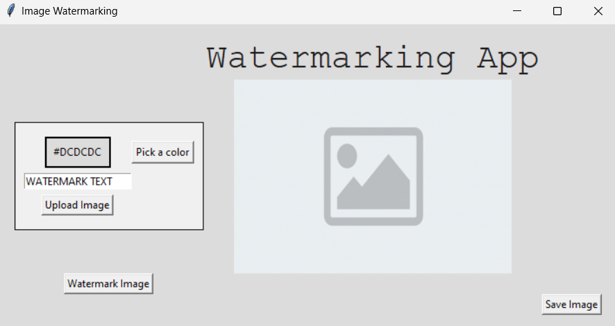

# Image Watermarking App


<br><br>


> This Python application allows users to watermark images with custom text and color. The user interface is built using Tkinter, and the image manipulation is performed with the Pillow (PIL) library.

## 📂 Files

- **main.py**: Contains the main execution code and Tkinter UI setup.
- **ui.py**: Imports the main function and executes the application.
- **functions.py**: Includes functions for image manipulation, such as opening an image, watermarking, selecting colors, and saving the final result.
- **images**: Folder containing sample images used by the application.

## 🛠️ Dependencies

- Python 3
- Pillow (PIL)
- Tkinter (should be available with Python)

## 🚀 How to Run

1. Ensure you have Python 3 installed on your system.
2. Install the required libraries using:
   ```bash
   pip install pillow
   ```
3. Run the application by executing main.py.


## 🏅 Developed During Python Bootcamp

This Breakout game was developed as part of the 100 Days of Code - The Complete Python Pro Bootcamp ([Course](https://www.udemy.com/course/100-days-of-code/)), a comprehensive course designed to teach Python programming through hands-on projects. This project showcases the skills and concepts learned in the course, including object-oriented programming, graphics with the Turtle library, and game development.

